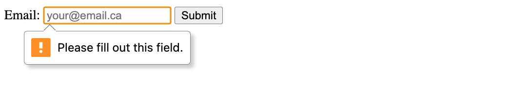

# Forms

All user interaction needs proper validation. Users should be prevented from adding trash as input to avoid unexpected program behavior.

## Why is Validation Important?

There are three main reasons:

- We need the right data, in the right format.
- We need to protect our users' information. (e.g. secure passwords)
- We need to protect ourselves. (e.g. nasty users)

## Validation MATTERS

Before submitting data to the server, it’s important to ensure that all the required form fields are filled in correctly. Without input validation, the user experience takes a hit:

```text
❌ BAD - no input validation ❌

(client) 💻 🗑️ -- POST --> 🗑️ 🗃️ (server wondering why you gave it trash)
```

By adding client-side validation, we can make sure the data matches the required format or rules before it's sent. This not only prevents bad data from reaching the server but also improves the user experience by allowing users to correct mistakes right away:

```text
✅ GOOD - input validation ✅

(client) 💻 🗑️ -- 🛑 (nope) -- POST --> 🗃️ (server with no knowledge of the occurrence of trash)
```

# Form Attributes

Forms consist of three key components:

- `action` 👉 Defines where the form data should be sent when submitted, typically a server URL.
- `target` 👉 Defines where the result of the form submission will be displayed. For example, you can open the result in a new tab or in the current window.
- `method` 👉 Determines the HTTP method used when submitting the form, usually either GET or POST.

## What does this look like in the code?

```html
<!-- Notice the 3 parts below -->
<form action="submit-form.php" target="_blank" method="post">
  <!-- other form content here -->
</form>
```

## Explanation

- `action="submit-form.php"` 👉 When the form is submitted, the data will be sent to `submit-form.php`.
- `target="_blank"` 👉 The result will open in a new tab.
- `method="post"` 👉 The form will use the POST method, which sends the data securely without including it in the URL.

# GET vs POST

So, what do "GET" and "POST" actually mean? For now, here’s the basic idea:

- "GET" retrieves data
- "POST" sends data

Think of it like mailing a letter:

```text
✉️ -- POST --> 📫 @ address

✉️ <-- GET -- 📫 @ address
```

In our example, the 'address' is the URL (like `submit-form.php`), and the `method` tells the server whether we’re sending ("POST") or retrieving ("GET") data.

```text
✉️ -- POST --> 🗃️ @ url

✉️ <-- GET -- 🗃️ @ url
```

In this case, the URL is `submit-form.php`, we’re using POST, and the data we’re sending is the result of a user’s input in the form.

## What does the data look like when it’s sent?

It depends on the method:

- With GET, the data is visible in the URL (which means the user can see it).
- With POST, the data is sent in the request body and can be encrypted if using `https`.

## The Rule of Thumb

Always use POST when the form contains sensitive information. Why? You don’t want someone’s password, email, or phone number to be exposed.

Would you share your social media passwords with your friends? Your family? Your partner? Probably not. That’s why we use POST requests, what people don’t see can’t be exploited.

# User Interaction

Use the `<input>` element as much as possible.

## Why?

Using the `<input>` element improves accessibility, provides built-in validation, enhances mobile experience, and ensures consistent behavior across ALL browsers. It reduces the need for custom JavaScript code, making forms cleaner for both the user and the developer.

TLDR: with the `<input>` element, you will be writing LESS JavaScript

## How?

To use the HTML `<input>` element, you include it in your `<form>` to accept user input:

```html
<!-- Form parent -->
<form action="submit-form.php" target="_blank" method="post">
  <!-- ... other stuff ... -->

  <!-- Notice the attributes -->
  <input type="email" id="email" name="email" placeholder="your@email.ca" />

  <!-- ... other stuff ... -->
</form>
```

## What do the different attributes mean?

- `type` 👉 Defines the kind of input
- `id` 👉 UNIQUELY Identifies an element on the page
- `name` 👉 Identifies the input data when the form is submitted
- `placeholder` 👉 A hint to the user about what to enter
- `min` && `max` 👉 Constraints for inputs like numbers or dates
- `value` 👉 Represents the current or default data for the input

## Input Types

You can specify different types of input, such as text, email, number, and [SOOOOO much more](https://developer.mozilla.org/en-US/docs/Web/HTML/Element/input#input_types). For the purposes of this class tho, please see below a few notable ones:

```html
<!-- Text -->
<input type="text" name="username" />

<!-- Email -->
<input type="email" name="email" />

<!-- Password -->
<input type="password" name="password" />

<!-- Numbers, with optional min/max -->
<input type="number" name="age" min="1" max="100" />

<!-- Date -->
<input type="date" name="birthday" />

<!-- Checkbox -->
<input type="checkbox" name="subscribe" />

<!-- Radio -->
<input type="radio" name="gender" value="male" /> Male
<input type="radio" name="gender" value="female" /> Female

<!-- Submit -->
<input type="submit" value="Submit" />
```

## Form Labels

The `<label>` element associates a text caption with an `<input>` field. Going back to our original example:

```html
<form action="submit-form.php" target="_blank" method="post">
  <!-- Notice the label -->
  <label for="email">Email:</label>
  <input type="email" id="email" name="email" placeholder="your@email.ca" />
  <!-- ... other stuff ... -->
</form>
```

## Why labels?

Using `<label>` for `<input>` has two major advantages compared to other text elements we are familiar with

- Screen readers can read out the label when the user is focused on the form input.
- Clicking on the label will focus/activate the input.

If you decide to go with regular text fields like `<h1>`, `<h3>`, and `<p>`, you will get none of the above advantages.

# Form Redirection

In User Interfaces you learnt how to use plain HTML to ensure validation. Today we are going to bring this to the next level with an event listener.

Let's say I had the following form:

```html
<form action="submit-form.php" target="_blank" method="post">
  <label for="email">Email:</label>
  <input type="email" id="email" name="email" placeholder="your@email.ca" />
  <input type="submit" value="Submit" />
</form>
```

And I wanted to handle the submission of the form effectively. What could I do?

## Option 1 - Pure HTML

I could a `required` field to the `input` of type `email`

```html
<form action="submit-form.php" target="_blank" method="post">
  <label for="email">Email:</label>
  <input
    type="email"
    id="email"
    name="email"
    placeholder="your@email.ca"
    required
  />
  <input type="submit" value="Submit" />
</form>
```

which should give me something like the following as an error message



Despite being the default option, how many of you encountered this specific error message in your lives? Probably never.

## Option 2 - An Inline Event Listener

If I wanted a more custom & modern error message, I would need to use an event listener. To start, I would need to include `onsubmit="return submitForm()"` to add the inline event listener:

```html
<form
  action="submit-form.php"
  target="_blank"
  method="post"
  onsubmit="return handleSubmit()"
>
  <label for="email">Email:</label>
  <input type="email" id="email" name="email" placeholder="your@email.ca" />
  <input type="submit" value="Submit" />
</form>
```

And without jQuery, my vanilla JavaScript would look like the following:

```js
function handleSubmit() {
  const email = document.getElementById("email").value;
  if (email === "") {
    alert("What is this trash");
    return false; // Prevent trash
  } else {
    return true; // Allow submission
  }
}
```

However, we can do better.

## Option 3 - Vanilla JavaScript Event Listener

Instead of making changes to the HTML form, we could create a vanilla JavaScript Event Listener as follows:

```js
// notice that we take an event as input
function handleSubmit(event) {
  const email = document.getElementById("email").value;
  if (email === "") {
    alert("What is this trash");
    // Notice the "preventDefault"
    event.preventDefault();
  }
}

// Step 1 - get the form
const form = document.getElementsByTagName("form")[0];

// Step 2 - add a listener
form.addEventListener("submit", handleSubmit);
```

Whatever that's written in vanilla JS can be done cleaner with jQuery. However before we explore the best way of doing this form submission, we need to first understand what "DOM Safety" is. More on that next class!

# Exercise 1

Take the above example and change it such that:

- It uses custom messages and no alerts
- It contains an "accept terms of service" checkbox button.

```html
<form action="submit-form.php" target="_blank" method="post">
  <label for="email">Email:</label>
  <input type="email" id="email" name="email" placeholder="your@email.ca" />
  <input type="submit" value="Submit" />
</form>
<script>
  function handleSubmit(event) {
    const email = document.getElementById("email").value;
    if (email === "") {
      alert("What is this trash");
      event.preventDefault();
    }
  }
  const form = document.getElementsByTagName("form")[0];
  form.addEventListener("submit", handleSubmit);
</script>
```


