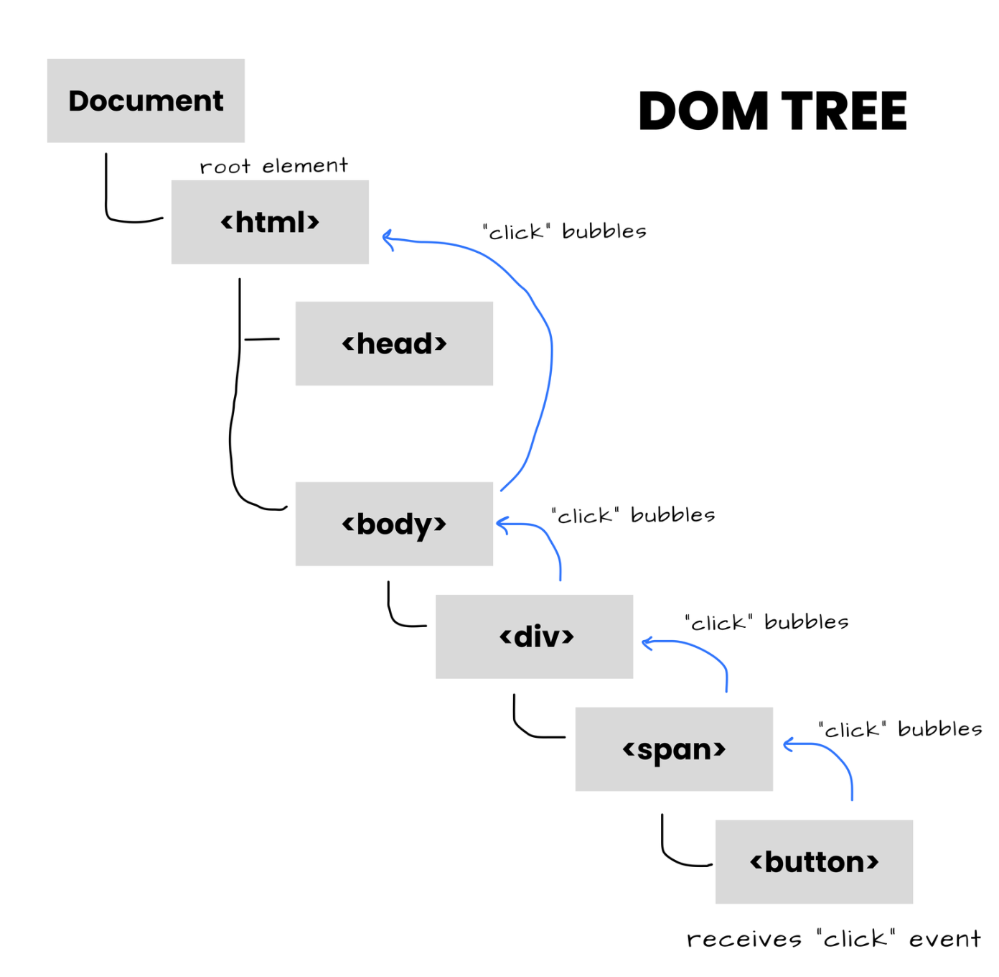
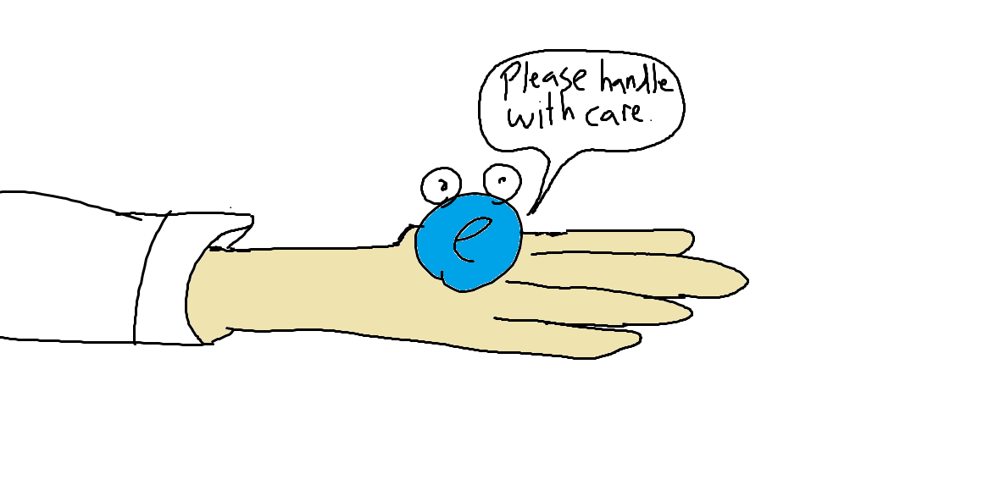

# Event Recap

## Why do we love events?

Web development focuses on crafting interactive and dynamic experiences for users, and events are at the heart of that interactivity

## Why do elements propagate events?

Event propagation is a key concept in web development that describes how events are managed within the document.

## How do we identify the cause of the event?

The DOM doesn't inherently know the event target until the event is triggered and propagates. Before reaching the source of the event, or _target_ element, an event is captured while descending through the DOM tree.

This is exactly when the DOM first knows the exact target.

## How do events propagate?

Once the event has been captured and we reach the _target_ element, it activates that element's event handler know that we know the target of the event.



After executing the handler on the _target_ element, the event "bubbles" up to its parent element, then to the grandparent, and so on, until it reaches the root of the DOM. This allows parent elements to also respond to events that happen on their children and becomes particularly evident when we have nested event handlers.

# Event Objects

An _event object_ is automatically created by the browser whenever an event occurs in the DOM.



## How is an Event made?

Once you click the browser, the following is triggered:

- Step 1: Event Trigger 👉 When a user interacts with an element, such as clicking a button, the browser detects this action and "triggers" the relevant event.
- Step 2: Automatic Creation 👉 The browser then _automatically_ generates an event object specific to that interaction and passes it to the event handler function. The event object contains various properties (e.g. `type`, `target`) and methods (e.g. `preventDefault()`, `stopPropagation()`, etc.). Developers can use these tools to effectively manage the event and its effects.

## What is the Event Life Cycle?

Going back to what we understand about propagation, once the event is triggered, it enters the capturing phase, where it travels from the root of the DOM down to the target element:

- Step 4: Capturing Phase 👉 The event starts at the document root and propagates down through each parent element to reach the target.
- Step 5: Target 👉 This is where the event can be handled by the target element’s own event listeners

After the event reaches the target, it then bubbles back up to the root:

- Step 6: Bubbling phase 👉 Any listeners on the ancestor elements that do not specify the capturing phase will be invoked.

This entire process occurs each time you interact with the browser.

## Button Example

Let's take a closer look at the event object in the context of buttons...

```html
<button id="myButton">Click Me!</button>

<script>
  const button = document.getElementById("myButton");

  button.addEventListener("click", function (event) {
    console.log("Event Type:", event.type); // notice me
    console.log("Target Element:", event.target); // notice me
  });
</script>
```

## Form Example

```html
<form id="myForm" action="submit-form.php" target="_blank" method="post">
  <label for="username">Username:</label>
  <input type="text" id="username" name="username" />
  <button type="submit">Submit</button>
</form>

<script>
  const form = document.getElementById("myForm");

  form.addEventListener("submit", function (event) {
    console.log("Event Type:", event.type); // notice me
    console.log("Target Element:", event.target); // notice me
    event.preventDefault(); // notice me
    const username = event.target.username.value; // notice me
    console.log(username);
  });
</script>
```

# Event Bubbling Best Practices

In our last class, we explored how event bubbling works. Now, we will learn how to use it effectively.

## Why?

Event bubbling has several practical applications that make it valuable:

- Event Delegation 👉 Instead of adding event listeners to each child element, you can attach a single listener to a parent element. This improves performance.
- Keeping it Simple 👉 Having a single listener for a group of elements simplifies the codebase. We don't need to add as many event listeners.

## Good Example

Here is an example of effective Event Delegation:

```html
<ul id="itemList">
  <li>Item 1</li>
  <li>Item 2</li>
  <li>Item 3</li>
</ul>

<script>
  const itemList = document.getElementById("itemList");

  // Event listener on the parent element
  itemList.addEventListener("click", function (event) {
    if (event.target.tagName === "li") {
      alert(`You clicked: ${event.target.textContent}`);
    }
  });
</script>
```

This is a good example because instead of attaching event listeners to each list item, you attach one listener to the parent `<ul>` element.

## Bad Example

If I wanted to write this code poorly, I could do the following:

```html
<ul id="itemList">
  <li>Item 1</li>
  <li>Item 2</li>
  <li>Item 3</li>
</ul>

<script>
  const items = document.querySelectorAll("#itemList li");

  // Adding event listeners to each <li>
  items.forEach((item) => {
    item.addEventListener("click", function () {
      alert(`You clicked: ${item.textContent}`);
    });
  });
</script>
```

Attaching individual click event listeners to each list item instead of using event delegation.

# Exercise

I invite you guys to experiment with the Butterfly example from yesterday and apply best practices.

