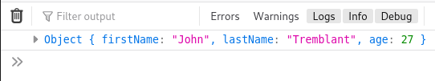
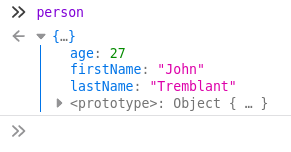
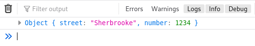
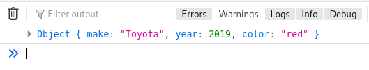
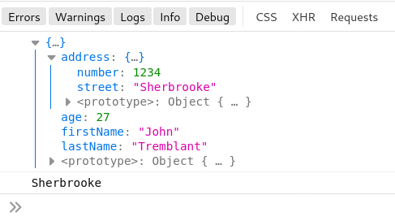

## Arrays

Arrays in JavaScript work similarly to other languages. Values are separated by commas.

Unlike most languages, in JS

​	 you do not declare the data type that will be stored in the array

​	 it is possible to **hold multiple data types** inside the same array

​	 

```javascript
let myArray = [123, "Hello!" , true, null];		// allowed
```

<br>

## Objects

In JavaScript objects are **name-value pairs** 

Everything that is not a primitive type is an object, including functions and properties inside the object.

<br>

> For simplicity, think of a JS object as a **variable that holds a collection of properties**. Each property is associated to a value.

<br>

### Objects creation

The "classic" notation for creating a new object is the following:

```javascript
let person = new Object();		// creates a new person object with no properties
```

<br>

You can **access and add properties** to this object by using the "." (dot) operator:

```javascript
person.firstName = "John";
person.lastName = "Tremblant";
person.age = 27;

console.log(person);
```

<br>



<br>

If we return the person object and expand it's properties, we can clearly see the list of key-value pairs:



<br>

### Object Literals { }


Objects are more easily created using the **object literal { } shorthand notation**:

<br>

```javascript
let address = {};		// object literal to create a new empty object

address.street = "Sherbrooke";
address.number = 1234;

console.log(address);
```



<br>

It is also possible to use the object literal to **create the object and its properties at the same time**:

```javascript
let car = {				// using line breaks for readability
    manufacturer: "Toyota",
    year: 2019,
    color: "red"
};

console.log(car);
```



<br>

An object can contain one or multiple other objects.

The object literal notation is very convenient for creating nested objects in "one shot":

<br>

<iframe height="328" style="width: 100%;" scrolling="no" title="wk12  - object literals -ex6" src="https://codepen.io/maujac/embed/yLYXVrP?height=328&theme-id=light&default-tab=js" frameborder="no" allowtransparency="true" allowfullscreen="true" loading="lazy">
  See the Pen <a href='https://codepen.io/maujac/pen/yLYXVrP'>wk12  - object literals -ex6</a> by Mauricio Buschinelli
  (<a href='https://codepen.io/maujac'>@maujac</a>) on <a href='https://codepen.io'>CodePen</a>.
</iframe>

<br>

The expanded output is:



<br>

### JavaScript particularities


As seen above, a property can be created by accessing the new property name on the object directly and assigning a value to it.

```javascript
let car = new Object();

car.age = 3;
```

<br>


Accessing the value of a property that does not exist on the object gives you the value of undefined:

```javascript
let car = new Object();

console.log( car.model ); // does not give an error as it would in C#. Logs undefined.
```


> Note: This flexibility can lead to bugs.  A developer might access a property that does not exist inadvertently when they misspell a property name that does exist on the object.  Obscure bugs might occur since no error is obtained.


<br>


## References 

#### JavaScript Reference Pages

1. [**JavaScript reference**](https://developer.mozilla.org/en-US/docs/Web/JavaScript/Reference) by MDN web docs.

   

<br>

## Hands-on

### Exercises

1. **Complete the following exercises from W3C Schools:**

   1. [Js Objects](https://www.w3schools.com/js/exercise_js.asp?filename=exercise_js_objects1)

   <br>

