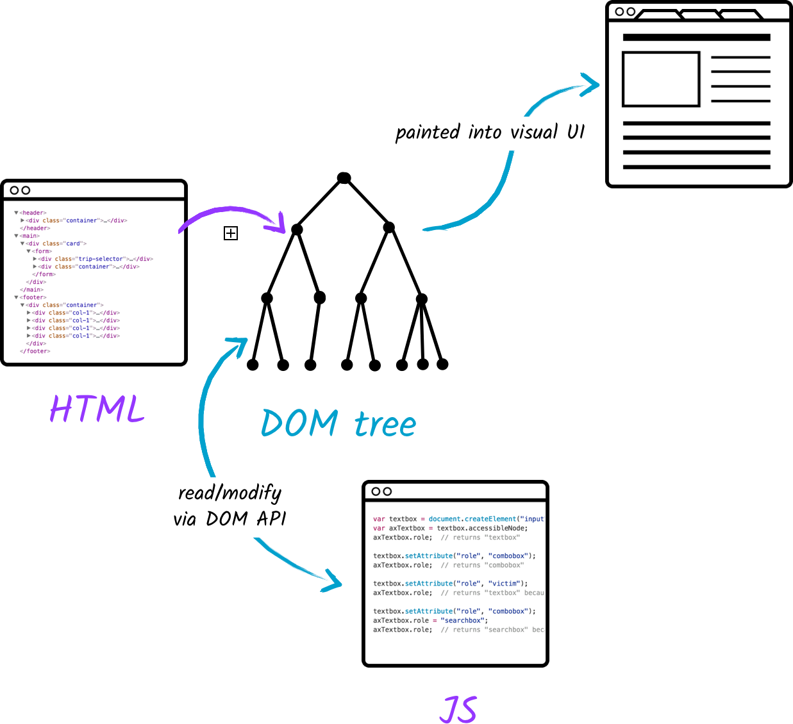
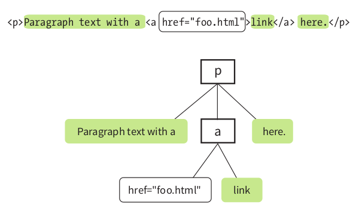
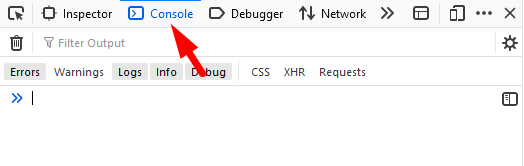
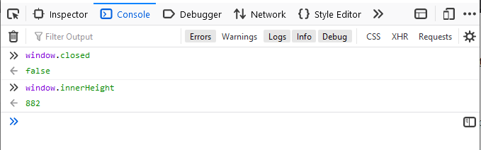
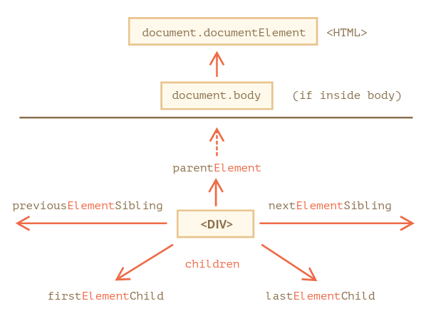
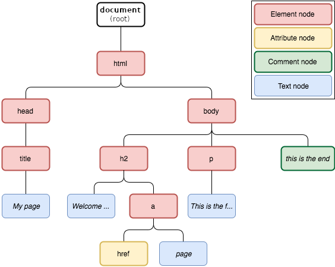

This lesson was based on the page [DOM tree](https://javascript.info/dom-nodes) by javescript.info

# The DOM

Based on what we've learned so far, one might think that the browser reads the HTML we write and immediately renders it in the browser.

However, that is not a complete picture.

## What is the DOM?

The **Document Object Model** (**DOM**) represents the HTML page content as objects. This representation takes the form of an logical tree. 

<br>

> The HTML is first converted into a heretical tree of elements (like a family tree) called the **Domain Object Model** or **DOM**.

The browser then reads from the DOM and finally renders elements in the screen.

<br>

```html
<!DOCTYPE html>
<html lang="en">
    <head>
        <meta charset="UTF-8">
        <meta name="viewport" content="width=device-width, initial-scale=1.0">
        <title>Dummy page</title>
        <link rel="stylesheet" href="style.css">
    </head>

    <body>
        <div class="wrapper">
            
            <h1>Welcome!</h1>
            <p>Lorem ipsum dolor sit.</p>
            <div></div>
        </div>
    </body>
</html>
```

<br>


<p align="center"><a href="https://www.kirupa.com/html5/finding_elements_dom_using_querySelector.htm"><em>The DOM Tree by Kirupa</em></a></p>

<br>

Once the HTML is used to create the DOM, it's job is done and it can no longer change it.

>  JavaScript can also create DOM elements, and unlike HTML, JavaScript can continuously add, remove and modify elements to the DOM. **It is dynamic.**

<br>

<p align="center"><a href="https://wicg.github.io/aom/explainer.html"><em>HTML and JavaScript interacting with the DOM by Web Incubator CG</em></em></a></p>

<br>

**The DOM's “root” object is called `window`**. It has two roles:

1. It represents the “browser window” and provides methods to query and control it.
2. It is a global object accessible to all running instances of JavaScript code.

<br>

**The `document` object is the main “entry point” to the page.** Each branch of the tree ends in a node, and each node contains objects.

<br>

### DOM Nodes

The DOM is a collection of nodes and every node is an object.

There are 3 types of nodes (objects):

- Element nodes;
- Attribute nodes;
- Text nodes (including comments).


<br>

In the example below:

- the white square are elements ( `<p>` and `<a>` )

- the green boxes are text nodes

- the white box with rounded edges is an attribute node

  <br>
  
  ```html
  <p>Paragraph text with a <a href="foo.html">link</a>here.</p>
  ```
  
  <br>



<p align="center"><a href="https://www.oreilly.com/pub/au/383"><em>Learning Web Design by Jennifer Robbins</em></a></p>
<br>

### White Space & Comments

See the code below and it's corresponding DOM Tree:

```html
<html>
    <head>
      <title>The DOM</title>
    </head>
    <body>
      The truth of the DOM
    </body>
</html>
```

<svg width="690" height="320"><g transform="translate(20,30)"><path class="link" style="fill: none; stroke: rgb(190, 195, 199); stroke-width: 1px;" d="M7,0L7,30L40.333333333333336,30"></path><path class="link" style="fill: none; stroke: rgb(190, 195, 199); stroke-width: 1px;" d="M7,0L7,180L40.333333333333336,180"></path><path class="link" style="fill: none; stroke: rgb(190, 195, 199); stroke-width: 1px;" d="M7,0L7,210L40.333333333333336,210"></path><path class="link" style="fill: none; stroke: rgb(190, 195, 199); stroke-width: 1px;" d="M40.333333333333336,210L40.333333333333336,240L73.66666666666667,240"></path><path class="link" style="fill: none; stroke: rgb(190, 195, 199); stroke-width: 1px;" d="M40.333333333333336,30L40.333333333333336,60L73.66666666666667,60"></path><path class="link" style="fill: none; stroke: rgb(190, 195, 199); stroke-width: 1px;" d="M40.333333333333336,30L40.333333333333336,90L73.66666666666667,90"></path><path class="link" style="fill: none; stroke: rgb(190, 195, 199); stroke-width: 1px;" d="M40.333333333333336,30L40.333333333333336,150L73.66666666666667,150"></path><path class="link" style="fill: none; stroke: rgb(190, 195, 199); stroke-width: 1px;" d="M73.66666666666667,90L73.66666666666667,120L107,120"></path><g class="node" transform="translate(0,0)" style="opacity: 1;"><rect y="-12.5" x="-5" rx="4" ry="4" height="25" width="250" style="fill: rgb(206, 224, 244); cursor: pointer;"></rect><text dy="4.5" dx="3.5" style="fill: black; pointer-events: none;">▾ </text><text dy="4.5" dx="16.5" style="font: 14px Consolas, Lucida Console, Menlo, Monaco, monospace; fill: rgb(51, 51, 51); pointer-events: none;">HTML</text></g><g class="node" transform="translate(33.33333206176758,30)" style="opacity: 1;"><rect y="-12.5" x="-5" rx="4" ry="4" height="25" width="250" style="fill: rgb(206, 224, 244); cursor: pointer;"></rect><text dy="4.5" dx="3.5" style="fill: black; pointer-events: none;">▾ </text><text dy="4.5" dx="16.5" style="font: 14px Consolas, Lucida Console, Menlo, Monaco, monospace; fill: rgb(51, 51, 51); pointer-events: none;">HEAD</text></g><g class="node" transform="translate(33.33333206176758,180)" style="opacity: 1;"><rect y="-12.5" x="-5" rx="4" ry="4" height="25" width="250" style="fill: rgb(255, 222, 153); cursor: pointer;"></rect><text dy="4.5" dx="3.5" style="fill: black; pointer-events: none;"></text><text dy="4.5" dx="5.5" style="font: 14px Consolas, Lucida Console, Menlo, Monaco, monospace; fill: rgb(51, 51, 51); pointer-events: none;">#text ↵␣␣</text></g><g class="node" transform="translate(33.33333206176758,210)" style="opacity: 1;"><rect y="-12.5" x="-5" rx="4" ry="4" height="25" width="250" style="fill: rgb(206, 224, 244); cursor: pointer;"></rect><text dy="4.5" dx="3.5" style="fill: black; pointer-events: none;">▾ </text><text dy="4.5" dx="16.5" style="font: 14px Consolas, Lucida Console, Menlo, Monaco, monospace; fill: rgb(51, 51, 51); pointer-events: none;">BODY</text></g><g class="node" transform="translate(66.66666412353516,240)" style="opacity: 1;"><rect y="-12.5" x="-5" rx="4" ry="4" height="25" width="250" style="fill: rgb(255, 222, 153); cursor: pointer;"></rect><text dy="4.5" dx="3.5" style="fill: black; pointer-events: none;"></text><text dy="4.5" dx="5.5" style="font: 14px Consolas, Lucida Console, Menlo, Monaco, monospace; fill: rgb(51, 51, 51); pointer-events: none;">#text 
  The truth of the DOM.</text></g><g class="node" transform="translate(66.66666412353516,60)" style="opacity: 1;"><rect y="-12.5" x="-5" rx="4" ry="4" height="25" width="250" style="fill: rgb(255, 222, 153); cursor: pointer;"></rect><text dy="4.5" dx="3.5" style="fill: black; pointer-events: none;"></text><text dy="4.5" dx="5.5" style="font: 14px Consolas, Lucida Console, Menlo, Monaco, monospace; fill: rgb(51, 51, 51); pointer-events: none;">#text ↵␣␣␣␣</text></g><g class="node" transform="translate(66.66666412353516,90)" style="opacity: 1;"><rect y="-12.5" x="-5" rx="4" ry="4" height="25" width="250" style="fill: rgb(206, 224, 244); cursor: pointer;"></rect><text dy="4.5" dx="3.5" style="fill: black; pointer-events: none;">▾ </text><text dy="4.5" dx="16.5" style="font: 14px Consolas, Lucida Console, Menlo, Monaco, monospace; fill: rgb(51, 51, 51); pointer-events: none;">TITLE</text></g><g class="node" transform="translate(100,120)" style="opacity: 1;"><rect y="-12.5" x="-5" rx="4" ry="4" height="25" width="250" style="fill: rgb(255, 222, 153); cursor: pointer;"></rect><text dy="4.5" dx="3.5" style="fill: black; pointer-events: none;"></text><text dy="4.5" dx="5.5" style="font: 14px Consolas, Lucida Console, Menlo, Monaco, monospace; fill: rgb(51, 51, 51); pointer-events: none;">#text The DOM</text></g><g class="node" transform="translate(66.66666412353516,150)" style="opacity: 1;"><rect y="-12.5" x="-5" rx="4" ry="4" height="25" width="250" style="fill: rgb(255, 222, 153); cursor: pointer;"></rect><text dy="4.5" dx="3.5" style="fill: black; pointer-events: none;"></text><text dy="4.5" dx="5.5" style="font: 14px Consolas, Lucida Console, Menlo, Monaco, monospace; fill: rgb(51, 51, 51); pointer-events: none;">#text ↵␣␣</text></g></g></svg></img>
<p align="center"><a href="https://javascript.info/dom-nodes"><em>DOM tree by JavaScript.info</em></a></p>

<br>

The text inside elements forms *text nodes*, labeled as `#text`.

A text node contains only a string. It may not have children and is always a leaf of the tree.


> Spaces, newlines and comments are totally valid characters, like letters and digits.
>
> They form text nodes and become a part of the DOM


<br>

To see the DOM of a simple page use the [Live DOM Viewer](https://software.hixie.ch/utilities/js/live-dom-viewer/#)

<br>

## Running JavaScript

To interact with the DOM we need to run JavaScript commands. Similarly to CSS, there are a few different ways to link JavaScript code to our page.

For now we will run JavaScript in two different ways:

- Via the `<script>` tag in inside the `html` file.
- Via the *Console* of the **Dev Tools**


### JS in the `script` tag

Add JavaScript code in a `<script> ` tag inside the HTML document (similarly to internal CSS).

<br>

***index.html***

```html
<head>
    <meta charset="UTF-8">
    <title>Sample Site</title>
    <link rel="stylesheet" href="path/to/style.css">
</head>
<body>
    <h1>Welcome!</h1>
    <p>This is a sample site</p>
    
    <script>
        let message = "This is JavaScript code being run";
        alert(message);
    </script>
</body>

```

<br>

### JS in the Dev Tools

When prototyping or debugging your code it is very common to inject JavaScript directly via the Dev Tools.

<br>



<br>

Try adding the code snip from *index.html* to see it executed in any page.

<br>

## The DOM API

The DOM provides an API (application programming interface) for **how to get, change, add, or delete HTML elements using JavaScript**.

The API defines:

- The HTML elements as **objects**  
- The **properties** of all HTML elements  
- The **methods** to access all HTML elements
- The **events** for all HTML elements

<br>


### The Window Object

The window object represents an open window in a browser. It has many properties and methods that can be accessed via it's API.

<br>



<p align="center"><em>Example of the DOM API used on the window object</em></p>

<br>

Examples of **Window Properties:**

| Property                                                     | Description                                                  |
| ------------------------------------------------------------ | ------------------------------------------------------------ |
| [closed](https://www.w3schools.com/jsref/prop_win_closed.asp) | Returns a Boolean value indicating whether a window has been closed or not |
| [console](https://www.w3schools.com/jsref/obj_console.asp)   | Returns a reference to the Console object, which provides methods for logging information to the browser's console ([See Console object](https://www.w3schools.com/jsref/obj_console.asp)) |
| [innerHeight](https://www.w3schools.com/jsref/prop_win_innerheight.asp) | Returns the height of the window's content area (viewport) including scrollbars |
| [screenX](https://www.w3schools.com/jsref/prop_win_screenx.asp) | Returns the horizontal coordinate of the window relative to the screen |
| [pageYOffset](https://www.w3schools.com/jsref/prop_win_pagexoffset.asp) | Returns the pixels the current document has been scrolled (vertically) from the upper left corner of the window |
| [document](https://www.w3schools.com/jsref/dom_obj_document.asp) | Returns the Document object for the window ([See Document object](https://www.w3schools.com/jsref/dom_obj_document.asp)) |

<br>

Examples of **Window Methods:**

| Method                                                       | Description                                              |
| ------------------------------------------------------------ | -------------------------------------------------------- |
| [alert()](https://www.w3schools.com/jsref/met_win_alert.asp) | Displays an alert box with a message and an OK button    |
| [close()](https://www.w3schools.com/jsref/met_win_close.asp) | Closes the current window                                |
| [prompt()](https://www.w3schools.com/jsref/met_win_prompt.asp) | Displays a dialog box that prompts the visitor for input |
| [resizeTo()](https://www.w3schools.com/jsref/met_win_resizeto.asp) | Resizes the window to the specified width and height     |
| [scrollTo()](https://www.w3schools.com/jsref/met_win_scrollto.asp) | Scrolls the document to the specified coordinates        |

<br>

For a larger list of the Window's methods and properties see  [this page from W3C Schools.](https://www.w3schools.com/jsref/obj_window.asp)

<br>

Similarly, the [**Document Object** also has a list of common properties and methods](https://www.w3schools.com/jsref/dom_obj_document.asp), which we will explore shortly. 

<br>

In the following example we will change the content  (the `innerHTML`) of the `<p>` element with `id="demo"`. 

<br>

<iframe height="333" style="width: 100%;" scrolling="no" title="wk11-DOM_JavaScript-ex1" src="https://codepen.io/maujac/embed/XWmMbGQ?height=333&theme-id=light&default-tab=html" frameborder="no" allowtransparency="true" allowfullscreen="true" loading="lazy">
  See the Pen <a href='https://codepen.io/maujac/pen/XWmMbGQ'>wk11-DOM_JavaScript-ex1</a> by Mauricio Buschinelli
  (<a href='https://codepen.io/maujac'>@maujac</a>) on <a href='https://codepen.io'>CodePen</a>.
</iframe>

<br>

In this case, `getElementById` is a **method**, while `innerHTML` is a  **property** of the `<p>` element.

<br>

There are many DOM API methods and properties for selecting and manipulating the DOM.

We just looked at the two most common:

<br>

- Method **getElementById** - used to access an HTML element that is identified with the specified id;

- Property **innerHTML** - getting or replacing the content of an element;

<br>

Let's look at some common DOM API methods available in the browser:


## Finding HTML Elements

The following methods belong to the Document object and can be used to select HTML elements on the page:

| Method                                                       | Description                                               |
| ------------------------------------------------------------ | --------------------------------------------------------- |
| [document.getElementById(*id*)](https://www.w3schools.com/js/js_htmldom_elements.asp) | Returns **one** element by element id                     |
| [document.getElementsByTagName(*name*)](https://www.w3schools.com/js/js_htmldom_elements.asp) | Returns an array with **multiple** elements by tag name   |
| [document.getElementsByClassName(*name*)](https://www.w3schools.com/js/js_htmldom_elements.asp) | Returns an array with **multiple** elements by class name |


<br>

## Changing HTML Elements

| Property                                                     | Description                                   |
| ------------------------------------------------------------ | --------------------------------------------- |
| [*element*.innerHTML = *new html content*](https://www.w3schools.com/jsref/prop_html_innerhtml.asp) | Change the inner HTML of an element           |
| [*element*.*attribute = "new value"*](https://www.w3schools.com/js/js_htmldom_html.asp) | Change the attribute value of an HTML element |
| [*element*.style.*property = "new style"*](https://www.w3schools.com/js/js_htmldom_css.asp) | Change the style of an HTML element           |
| **Method**                                                   | **Description**                               |
| [*element*.setAttribute(*attribute, value*)](https://www.w3schools.com/jsref/met_element_setattribute.asp) | Change the attribute value of an HTML element |

<br>

> In JavaScript, when referring to CSS properties that use a hyphen (eg. `font-size`), it is necessary to convert their names to camel-case (eg. `fontSize`).
>
> Otherwise, the hyphen would be interpreted as the subtraction operation.


<br>

**Examples**

<iframe height="401" style="width: 100%;" scrolling="no" title="wk11-find_change-ex3" src="https://codepen.io/maujac/embed/PoPpZQr?height=401&theme-id=light&default-tab=html,result" frameborder="no" allowtransparency="true" allowfullscreen="true" loading="lazy">
  See the Pen <a href='https://codepen.io/maujac/pen/PoPpZQr'>wk11-find_change-ex3</a> by Mauricio Buschinelli
  (<a href='https://codepen.io/maujac'>@maujac</a>) on <a href='https://codepen.io'>CodePen</a>.
</iframe>


<br>

## Walking the DOM

Since the DOM has a tree structure, it is possible to "walk" or move inside it from one object to another.

<br>

>  We will focus on navigation that take only **element nodes** into account since Element nodes represent HTML tags and form the structure of the page.
>
> (as opposed to all nodes, which can include **text nodes**).


In order to navigate between **element nodes only** you can use the following methods:

<br>

- `children` – only those children that are element nodes.
- `firstElementChild`, `lastElementChild` – first and last element children.
- `previousElementSibling`, `nextElementSibling` – neighbor elements.
- `parentElement` – parent element.

<br>

For example, consider the following  `<div>`  element:

<br>

***index.html***

```html
<body>
	<h1>CodeHeap - Learning to Code</h1>
	<div id="my_div">
    	<h2>Welcome!</h1>
        <p>Thank you for visiting our page.</p>
		<p>Book your spot today.</p>
	</div>
    <a href="./contact.html"></a>
</body>
```

<br>

Once we have a deference to the `<div>`  we can *move around* the DOM: 

<br>

```js
let the_div = document.getElementById("my_div");	// Get reference to the div
let next_sibling = the_div.nextElementSibling;		// Get the a element
let first_child = the_div.firstElementChild;		// Get the h2 element
let parent = the_div.parent;						// Get the body
```

<br>





<p align="center"><a href="https://javascript.info/dom-nodes"><em>DOM tree by JavScript.info</em></a></p>

<br>

For your information, the equivalent methods for selecting any node, **including text nodes**:

-  `parentNode`, `childNodes`, `firstChild`, `lastChild`, `previousSibling`, `nextSibling`.

<br>

In the example below, we move inside the DOM in order to select and modify related elements:

<iframe height="472" style="width: 100%;" scrolling="no" title="wk11-walking-ex4" src="https://codepen.io/maujac/embed/bGVqEzE?height=472&theme-id=light&default-tab=html,result" frameborder="no" allowtransparency="true" allowfullscreen="true" loading="lazy">
  See the Pen <a href='https://codepen.io/maujac/pen/bGVqEzE'>wk11-walking-ex4</a> by Mauricio Buschinelli
  (<a href='https://codepen.io/maujac'>@maujac</a>) on <a href='https://codepen.io'>CodePen</a>.
</iframe>


<br>

## References & Diving Deeper

**Quick Reference:**




<p align="center"><a href="https://blog.scrapinghub.com/2016/10/27/an-introduction-to-xpath-with-examples"><em>DOM Tree by Valdir Stumm</em></a></p>
<br>

Start here:

1. **[Common DOM API Methods & Properties](https://www.w3schools.com/js/js_htmldom_document.asp)** (summary)


<br>

Can't find a method or property? Use Ctrl + F in pages below:


2. [**Window API**](https://developer.mozilla.org/en-US/docs/Web/API/Window) (complete)
2. [**Document API**](https://developer.mozilla.org/en-US/docs/Web/API/Document) (complete)
3. [**Nodes API**](https://developer.mozilla.org/en-US/docs/Web/API/Node) (complete)
4. [**Elements API**](https://developer.mozilla.org/en-US/docs/Web/API/Element) (complete)

   

<br>

**Recommended readings:**

- [DOM tree](https://javascript.info/dom-nodes) by javescript.info

<br>


## Hands-on


### Exercises

Complete **exercises  1 to 8** from W3C Schools:

1. [JS HTML DOM](https://www.w3schools.com/js/exercise_js.asp?filename=exercise_js_dom_html1)

   