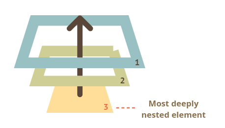

This section is based on the page [Introduction to browser events](https://javascript.info/introduction-browser-events) by javascript.info


<br>

### Catching event objects

When writing an event handler, it is possible to "catch" the event object created by the browser.

Once captured, the event details (stored as object properties) can be used inside the event handler.

<br>


<p align="center"><a href="https://www.fraghero.com/pokemon-lets-go-players-found-way-make-catching-easier-every-time/"><em>Image by fraghero.com</em></a></p>
<br>

To catch the event that triggered the callback function:

1. List the event as a function argument in the function declaration (optional)
2. Use the event object inside the function.


The event object is automatically passed to the callback function as the first argument.


<br>

<iframe height="250" style="width: 100%;" scrolling="no" title="wk13 - events - event-capture - ex4" src="https://codepen.io/maujac/embed/RwWxMZe?height=250&theme-id=dark&default-tab=js" frameborder="no" allowtransparency="true" allowfullscreen="true">
  See the Pen <a href='https://codepen.io/maujac/pen/RwWxMZe'>wk13 - events - event-capture - ex4</a> by Mauricio Buschinelli
  (<a href='https://codepen.io/maujac'>@maujac</a>) on <a href='https://codepen.io'>CodePen</a>.
</iframe>


<br>

Note that:

- The name of the "event argument" can be anything.  Common names are "event" or "e".
- When assigning an event handler as HTML attributes, the event object must be included in attribute description and it must be named "event".


<br>

<iframe height="200" style="width: 100%;" scrolling="no" title="wk13 - events -  - ex5" src="https://codepen.io/maujac/embed/xxwpjze?height=265&theme-id=dark&default-tab=html" frameborder="no" allowtransparency="true" allowfullscreen="true">
  See the Pen <a href='https://codepen.io/maujac/pen/xxwpjze'>wk13 - events -  - ex5</a> by Mauricio Buschinelli
  (<a href='https://codepen.io/maujac'>@maujac</a>) on <a href='https://codepen.io'>CodePen</a>.
</iframe>


<br>

## Event Bubbling

In the example below, we add an event listener for the "click" event on the `<div>` . However, the event is also being fired when we click on the `<button>`.


<br>

<iframe height="265" style="width: 100%;" scrolling="no" title="wk13 - events - bubbling - ex6" src="https://codepen.io/maujac/embed/gOaoKrR?height=265&theme-id=dark&default-tab=js,result" frameborder="no" allowtransparency="true" allowfullscreen="true">
  See the Pen <a href='https://codepen.io/maujac/pen/gOaoKrR'>wk13 - events - bubbling - ex6</a> by Mauricio Buschinelli
  (<a href='https://codepen.io/maujac'>@maujac</a>) on <a href='https://codepen.io'>CodePen</a>.
</iframe>


<br>

If we inspect the `event.target`  and the `event.currentTarget` we will notice that:

- `event.currentTarget`  always returns the `<div>`  as expected;
- `event.target`  sometimes returns the `<button>`  if we click on the button.

<br>

This is happening due to **Event Bubbling**:

> **When an event happens on an element, it triggers the handlers on that element, then on its parent, then all the way up on other ancestors.**


<br>

Consider 3 nested elements `FORM > DIV > P`:

<br>

<iframe height="265" style="width: 100%;" scrolling="no" title="wk13 - events - bubbling_ex2 - ex7" src="https://codepen.io/maujac/embed/oNjpyGz?height=265&theme-id=dark&default-tab=html,result" frameborder="no" allowtransparency="true" allowfullscreen="true">
  See the Pen <a href='https://codepen.io/maujac/pen/oNjpyGz'>wk13 - events - bubbling_ex2 - ex7</a> by Mauricio Buschinelli
  (<a href='https://codepen.io/maujac'>@maujac</a>) on <a href='https://codepen.io'>CodePen</a>.
</iframe>


<br>

A click on the inner `<p>` first runs `onclick`:

1. On that `<p>`.
2. Then on the outer `<div>`.
3. Then on the outer `<form>`.
4. And so on upwards till the `document` object.


<br>



<p align="center"><a href="https://javascript.info/bubbling-and-capturing"><em>Bubbling and capturing by javascript.info</em></a></p>

<br>


### Event target vs currentTarget

As you saw above, a handler on a parent element can always get the details about where it actually happened.

> **The element that caused the event is called a "target" element, accessible as `event.target`.**


<br>

If we have a single handler on `form.onclick`, then it can “catch” all clicks inside the form. No matter where the click happened, it bubbles up to `<form>` and runs the handler.

<br>

> **`event.currentTarget` returns the element who is calling the event handler.**
>
> In other words, `event.currentTarget` returns the element who was listening for the event and triggered the callback function.


<br>

The use of `event.target`  vs  `event.currentTarget`  is particularly useful when trying to delete notes that are positioned relative to an element listening for an event.


Notice the difference between  `event.target`  vs  `event.currentTarget`  when clicking on the icon:

<br>

<iframe height="282" style="width: 100%;" scrolling="no" title="wk13 - events - target vs currentTarget" src="https://codepen.io/maujac/embed/YzNBbaE?height=282&theme-id=dark&default-tab=js,result" frameborder="no" loading="lazy" allowtransparency="true" allowfullscreen="true">
  See the Pen <a href='https://codepen.io/maujac/pen/YzNBbaE'>wk13 - events - target vs currentTarget</a> by Mauricio Buschinelli
  (<a href='https://codepen.io/maujac'>@maujac</a>) on <a href='https://codepen.io'>CodePen</a>.
</iframe>


<br>

### Stopping bubbling

A bubbling event goes from the target element all the way to the `document` object. 

**To stop the event bubbling** at a specific handler use the method `event.stopPropagation()`.


<br>

<iframe height="381" style="width: 100%;" scrolling="no" title="wk13 - events - stop_bubbling - ex8" src="https://codepen.io/maujac/embed/jObYKQR?height=381&theme-id=dark&default-tab=js" frameborder="no" allowtransparency="true" allowfullscreen="true">
  See the Pen <a href='https://codepen.io/maujac/pen/jObYKQR'>wk13 - events - stop_bubbling - ex8</a> by Mauricio Buschinelli
  (<a href='https://codepen.io/maujac'>@maujac</a>) on <a href='https://codepen.io'>CodePen</a>.
</iframe>

<br>

> Don’t stop bubbling without a need.
>
> Most of the time bubbling is convenient and can be used in your favor.

<br>

Bubbling can be used in a pattern called **event-delegation** where all events are caught by a common parent but handled differently according to the `target` where the event is occurring:

<br>

<iframe height="265" style="width: 100%;" scrolling="no" title="wk13 - events - good_bubbling - ex10" src="https://codepen.io/maujac/embed/xxwpeaB?height=265&theme-id=dark&default-tab=html,result" frameborder="no" allowtransparency="true" allowfullscreen="true">
  See the Pen <a href='https://codepen.io/maujac/pen/xxwpeaB'>wk13 - events - good_bubbling - ex10</a> by Mauricio Buschinelli
  (<a href='https://codepen.io/maujac'>@maujac</a>) on <a href='https://codepen.io'>CodePen</a>.
</iframe>
<br>


## Preventing default behavior

Sometimes it is desirable to stop a default behavior without necessarily stopping bubbling.


>  This is done with the method: `event.preventDefault()`;


For example, by default, when a `<button>` or `<input type=button>` element is clicked inside a `<form>` , the **form is submitted automatically**. 


A common example of stopping default behavior is to stop the `<button>` or `<input>` from submitting without necessarily stopping the `"click"` event from bubbling.

<br>

<iframe height="265" style="width: 100%;" scrolling="no" title="wk13 - events - preventDefault - ex9" src="https://codepen.io/maujac/embed/LYpeBEj?height=265&theme-id=dark&default-tab=js,result" frameborder="no" allowtransparency="true" allowfullscreen="true">
  See the Pen <a href='https://codepen.io/maujac/pen/LYpeBEj'>wk13 - events - preventDefault - ex9</a> by Mauricio Buschinelli
  (<a href='https://codepen.io/maujac'>@maujac</a>) on <a href='https://codepen.io'>CodePen</a>.
</iframe>


<br>

> Note that event bubbling and preventing default behavior are two different and isolated mechanism.
>
> You can stop them independently.


For example, you can stop a form from being submitted on a button click, however, the click event will still bubble up through the DOM tree.

### Form validation & submit event

In the previous example, the form submission was prevented by stopping the default behaviour of a click inside a form.

However, it is important to choose the correct point in the event-chain to stop the default behaviour.

<br>

> The `<form>` element offers native user input validation. However, **validation can only happen once the `<form>` observes a `submit` event.**
>
> A submit event is only triggered inside the form after a button is clicked.

<br>


<br>

Try adding an invalid email to the previous example. The form is not validating user input because the default behaviour was stopped when the button observed a "click", not when the form observed a "submit".

<br>

To allow the `<form>` to validate user input, stop default behaviour once the `<form>` experiences a `submit` event:

<br>

<iframe height="337" style="width: 100%;" scrolling="no" title="wk13 - events - Form &amp; preventDefault - ex10" src="https://codepen.io/maujac/embed/PoppBdN?height=337&theme-id=dark&default-tab=js,result" frameborder="no" loading="lazy" allowtransparency="true" allowfullscreen="true">
  See the Pen <a href='https://codepen.io/maujac/pen/PoppBdN'>wk13 - events - Form &amp; preventDefault - ex10</a> by Mauricio Buschinelli
  (<a href='https://codepen.io/maujac'>@maujac</a>) on <a href='https://codepen.io'>CodePen</a>.
</iframe>

<br>

## Anonymous & Arrow Functions

It is often the case that event handler functions only get referenced once when attaching them to elements via `addEventListener`.

In those cases, it can be faster to declare the function directly inside `addEventListener` rather than in a named function. For these and other similar cases, JavaScript allows the use of anonymous and arrow functions.

<br>

**Named Functions**

So far we've only looked at named functions. The function is declared at one point in the code and then referenced somewhere else:

<br>

```js
const myBtn = document.getElementById('btn');

function callMeBack(eve){
  console.log('Clicked at ' + eve.target.tagName );
}

myBtn.addEventListener("click", callMeBack);
```

<br>

**Anonymous Functions**

Anonymous functions are declared immediately instead of referencing a named function that is declared elsewhere in the code:

<br>

```js
const myBtn = document.getElementById('btn');

myBtn.addEventListener("click", function(eve){
  console.log('Clicked at ' + eve.target.tagName );
});
```

<br>

**Arrow Functions**

Arrow functions offer a syntax that is even shorter than anonymous functions.

In addition to the syntax difference, arrow functions treat the `this` word differently, however, we will not cover `this` in this course.

<br>

```js
const myBtn = document.getElementById('btn');

myBtn.addEventListener("click", (eve) => {
  console.log('Clicked at ' + eve.target.tagName );
});
```

<br>

<iframe height="445" style="width: 100%;" scrolling="no" title="wk13 - events - anonymous functions" src="https://codepen.io/maujac/embed/OJWKYgP?height=445&theme-id=dark&default-tab=js" frameborder="no" loading="lazy" allowtransparency="true" allowfullscreen="true">
  See the Pen <a href='https://codepen.io/maujac/pen/OJWKYgP'>wk13 - events - anonymous functions</a> by Mauricio Buschinelli
  (<a href='https://codepen.io/maujac'>@maujac</a>) on <a href='https://codepen.io'>CodePen</a>.
</iframe>

<br>

## Recommended reading

[**Introduction to browser events**](https://javascript.info/introduction-browser-events) by javascript.info 


<br>

## References

*Reference links by MDN web docs.*

### Complete List of Browser Events

[**Event reference**](https://developer.mozilla.org/en-US/docs/Web/Events)

<br>

### Event Type API

[**Generic event properties**](https://developer.mozilla.org/en-US/docs/Web/API/Event#Properties) (common to all event types).

[**Specific event properties**](https://developer.mozilla.org/en-US/docs/Web/API/Event#Introduction) (choose the event type from the list. Eg.: *MouseEvent* or *KeyboardEvent*).

<br>


## Hands-on - wk13

### Lab 1- Mouse colors

#### Part 1

Create a container where the background color changes depending on the mouse position over the container.

**The color change should be consistent and not random.**

<details>
    <summary>Display hint</summary>
    <ul>
        <li>For mouse events, you can use the event.offsetX and offsetY to get the mouse position with respect to the top-left of the element listening to the event.</li><br>
    </ul>
</details>

<br>

#### Part 2

Allow the color to change according to the mouse position (like above) but **only when the mouse is clicked while the alt key is pressed.**

<details>
    <summary>Display hint</summary>
    <ul>
        <li>To read the state of the Alt key, check the MouseEvent reference in the Event Types of the the notes.</li><br>
    </ul>
</details>

<br>

<iframe height="368" style="width: 100%;" scrolling="no" title="wk13 - Lab 3 - Mouse colors" src="https://codepen.io/maujac/embed/GRpQaeM?height=368&theme-id=dark&default-tab=css,result" frameborder="no" allowtransparency="true" allowfullscreen="true">
  See the Pen <a href='https://codepen.io/maujac/pen/GRpQaeM'>wk13 - Lab 3 - Mouse colors</a> by Mauricio Buschinelli
  (<a href='https://codepen.io/maujac'>@maujac</a>) on <a href='https://codepen.io'>CodePen</a>.
</iframe>


**[Link to Part 1 Solution](https://codepen.io/maujac/pen/gOaKPGZ)**

<br>


### Lab 2 - Balloon Challenge

Write a page that displays a balloon (using the balloon emoji, 🎈).  When you press the up arrow, it should inflate (grow) 10 percent, and  when you press the down arrow, it should deflate (shrink) 10 percent.

You can control the size of text (emoji are text) by setting the `font-size` CSS property (`style.fontSize`) on its parent element. Remember to include a unit in the value—for example, pixels (`10px`).

The key names of the arrow keys are `"ArrowUp"` and `"ArrowDown"`. Make sure the keys change only the balloon, without scrolling the page.

When that works, add a feature where, if you blow up the balloon past a  certain size, it explodes. In this case, exploding means that it is  replaced with an 💥 emoji, and the event handler is removed (so that you can’t inflate or deflate the explosion).

<br>

<details>
    <summary>Display hints</summary>
    <ul>
        <li>You’ll want to register a handler for the "keydown" event and look at event.key to figure out whether the up or down arrow key was pressed.</li><br>
        <li>The current size can be kept in a binding so that you can base the new size on it. It’ll be helpful to define a function that updates the size—both the binding and the style of the balloon in the DOM—so that you can call it from your event handler, and possibly also once when starting, to set the initial size.</li><br>
        <li>You can change the balloon to an explosion by replacing the text node with another one (using replaceChild) or by setting the textContent property of its parent node to a new string.</li>
    </ul>
</details>
<!-- [**Link to solution**](https://codepen.io/maujac/pen/MWaBggj) -->


<br>

